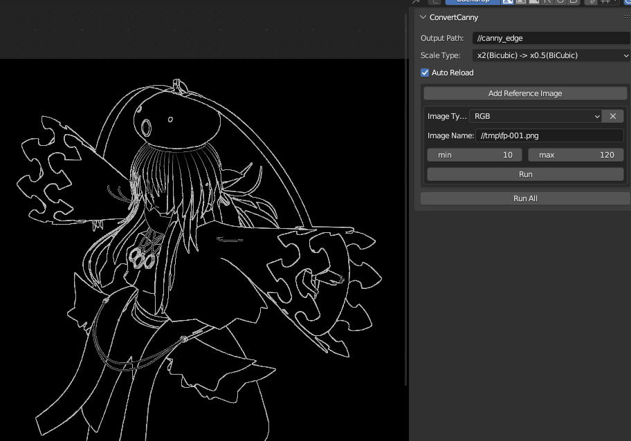
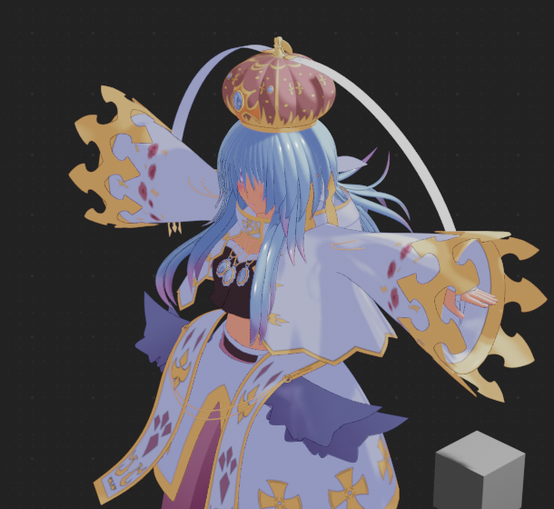

# CompositPIL
## 何をするアプリ？
BlenderのフィルタにCannyがないので、じゃぁCanny用の画像を保存しておいてBlenderの外でCannyで線画だせばいいじゃない。

というわけでOpenCVでCannyでエッジ検出をしてファイルに出力するアプリです。



こんな感じに合成できます




## 注意事項(重要)
このアプリはお使いのPCにアプリ用サーバを起動します。

使用するポートはlocalhost:8080のみですが、所属する組織(orご家庭)のセキュリティーポリシーに反する可能性があります。
実行前に必ずセキュリティ担当者に確認を行うようにしてください。

サーバを立てるような野良アプリは基本不許可とするのが通常の判断です。
使えなくてもガッカリしないでね？(´・ω・`)

個人で使用するにしても、サーバを立てるような野良アプリは自己責任で安全を確認できる場合にのみ使用することをお勧めします。

自分で安全を確信できないときは、安全が確認された有名なアプリを誰かが作ってくれることを期待して待っていましょう。

まじヤバイアプリも普通にあるでござるでな…

## 導入の仕方
開発中なのでちょっとメンドウだけど、いつ公開版作るかわからない(たぶん作らない)ので開発版での使い方を書いておきます。

### Addonのインストール
まずはGithubリポジトリのCodeからZIPをDownloadしてください。CompositPIL_main.zipというファイルが取得できるので解凍しておいてください。

この中にCompositPIL_AddonというフォルダがあるのでZIP圧縮してCompositPIL_Addon.zipというzipファイルを作ってください。

この作ったzipファイルがBlenderのAddonとしてInstallできるものとなります。

### Pythonの準備
Python3の実行環境を必要とします。たぶんAnacondaでも大丈夫……かなあ?

opencv-pythonモジュールが必要なのでpipでインストールしてください。requirements.txtをつけておきましたので、次のコマンドで必要なモジュールを一気に入れることができます。
```shell
pip install -r requirements.txt
```

### サーバ起動
常に起動する必要はありません。CompositPILアドオンの実行ボタンを押す直前で起動すれば十分です。

CompositPIL_mainを解凍したフォルダ内にCompositPIL_Serverというフォルダがあります。
このフォルダの中で次のコマンドを打つと起動します。
```shell
python CompositPILServer.py
```

次のような出力の後停止したらサーバの起動完了です。
メッセージの通り停止はCtrl+Cです。

```shell
Bottle v0.13-dev server starting up (using WSGIRefServer())...
Listening on http://localhost:8080/
Hit Ctrl-C to quit
```

### 使い方
一旦エッジ検出に使う画像ファイルを普通にレンダリングして保存してください。

エッジ出力用シーン等を作ってCompositingのCompositPILアドンのタブにエッジ検出用ファイルを設定します。

ファイル名はだいたいBlenderの規則と同じです。\//が開いている.blendファイルの場所、#は0-9の数字に置き換わります。

Runボタンを押すとOutputPathに指定されたフォルダ内に変換元ファイル名と同名のファイルが出力されます。

出力されたpngファイルはカラーマネジメントされていませんので、`non-color`で読み込んでください。

#### 線画検出用イメージタイプについて
イメージタイプ別に処理を複数用意しました。

例えばAlphaClipの部分に使いたい場合、Alphaのグレースケール画像ファイルを用意してALPHAモードを使用するか、透過PNGを用意してRGBAモードを使用してください。

深度を使いたいときは深度をNormalizeしたグレースケール画像を用意して、BWかDEPTHモードを使ってください。現在この2つは同じことをします。

FreePencilのような塗り分け法を使用している場合、そのカラーデータを入力画像ファイルとして使えます。この場合RGBモードが適切です。

